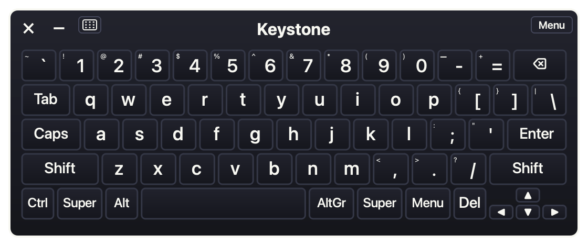

# Keystone

**A full-size, themeable on-screen keyboard for Linux — the Onboard replacement that works on Wayland.**

Keystone is a practical desktop on-screen keyboard for GNOME and KDE (Wayland and
X11). It fills the gap left when the old X11 keyboards stopped working under
Wayland: a resizable, good-looking, full keyboard — number row, function keys,
navigation cluster and numpad — that you can actually use on a modern desktop.



## Features

- **Full and compact layouts** — switch between a complete keyboard (F-row, nav
  cluster, numpad) and a slim typing layout.
- **Resizable & draggable** — scales cleanly from a small floating bar to a large
  keyboard; remembers size and position per mode.
- **Themeable** — six built-in themes (Dracula, Midnight, Mocha, Dusk, Dark,
  Light) plus drop-in custom theme packs, including theme inheritance.
- **Word suggestions** — offline autocomplete with learned words.
- **System tray + restore icon** — minimizes to the tray, with a draggable
  on-screen restore icon as a fallback when no tray is available.
- **Load on startup** — a menu toggle (XDG autostart) starts Keystone tray-only
  at login.
- **Single-instance control** — show/hide/toggle from the command line or a
  keybinding.

## Requirements

- Python 3.11+
- [PySide6](https://pypi.org/project/PySide6/) (Qt 6)
- [`ydotool`](https://github.com/ReimuNotMoe/ydotool) — used to emit keystrokes.
  `ydotoold` must be running and your user must have access to `/dev/uinput`.
- *(optional)* `wl-clipboard` — enables clipboard-based text/emoji output;
  otherwise keys are typed individually via `ydotool`.

### Why ydotool?

Wayland deliberately blocks applications from injecting keystrokes the way X11
allowed — which is exactly why the older on-screen keyboards broke. Keystone
emits input through `ydotool`'s `uinput` device, so it works under Wayland. The
trade-off is a one-time setup: the `ydotoold` daemon must run and your user needs
permission to write to `/dev/uinput`.

```bash
# Install ydotool (Arch example)
sudo pacman -S ydotool

# Allow your user to use /dev/uinput, then start the daemon
sudo usermod -aG input "$USER"        # log out/in afterwards
systemctl --user enable --now ydotool # or run `ydotoold` manually
```

Run `keystone-osk --doctor` to check that everything is wired up correctly.

## Installation

### Arch Linux (PKGBUILD)

```bash
makepkg -si
```

### From source

```bash
cd source
python -m build
pip install dist/*.whl
```

## Usage

```bash
keystone-osk                 # start the keyboard
keystone-osk --mode full     # start in the full layout
keystone-osk --theme mocha   # pick a theme
```

Diagnostics and control:

```bash
keystone-osk --doctor        # environment / dependency check
keystone-osk --list-themes   # list available theme packs
keystone-osk --show          # show / focus a running instance
keystone-osk --hide          # hide a running instance
keystone-osk --toggle        # toggle visibility (bind to a hotkey)
keystone-osk --quit          # quit a running instance
```

## Theming

Built-in themes: `dracula`, `midnight`, `mocha`, `dusk`, `dark`, `light`.

Add your own by dropping a `theme.json` into:

```
~/.local/share/keystone/themes/<your-theme-id>/theme.json
```

A theme pack can set colors, opacity, and icon overrides, and can `inherit`
from a built-in or another pack. The schema also reserves `font`, `spacing`,
`corner_radius`, and `border_width` for future theme expansion, but those
fields are not applied to rendering yet. Run `keystone-osk --list-themes`
to confirm a pack is detected and valid.

The built-in ids above are reserved — a pack reusing one is ignored (and
flagged in `--doctor`), so give your pack a new id and `inherit` the built-in
to customize it.

## Configuration

Keystone follows the XDG base directories:

- Window state: `~/.local/state/keystone-osk/window-state.json`
- Learned words: `~/.local/state/keystone-osk/words.json`
- Custom themes: `~/.local/share/keystone/themes/`

## Troubleshooting

### Blurry halo around the minimized icon on KDE (Better Blur)

If you use the **Better Blur** KWin effect (`kwin-effects-better-blur` /
`better_blur_dx`, shipped by default on Garuda Mokka) with "Blur non-matching
windows" enabled, it force-blurs a region around every window not on its
exclusion list. This draws a blurry frame around Keystone's minimized desktop
icon that no app-side setting can prevent.

Fix: add `keystone-osk` to the effect's window-class exclusion list, either in
System Settings → Desktop Effects → Blur (Better Blur) → window classes, or
directly in `~/.config/kwinrc` under `[Effect-better-blur-dx]`:

```ini
WindowClasses=xwaylandvideobridge\nvlc\nkeystone-osk
```

(keep any existing entries, `\n`-separated). The effect only classifies
windows when they are created, so restart Keystone (or log out and back in)
for the exclusion to take effect.

## License

Keystone is free software released under the **GNU General Public License v3.0 or
later** (`GPL-3.0-or-later`). See [`source/LICENSE`](source/LICENSE) for the full
text. You're free to use, study, modify and share it; modified versions you
distribute must also be GPL-licensed with source available.

## Support development

Keystone is free to use. If it saves you typing, consider chipping in — anything
helps, **$5 is great, $10 helps pay the bills.** There are generous people out
there. 🙏

> ☕ **[Support Keystone on Ko-fi](https://ko-fi.com/keystoneosk)**

Thank you for trying Keystone.

---

Copyright © 2026 keystoneosk. Licensed under GPL-3.0-or-later.
